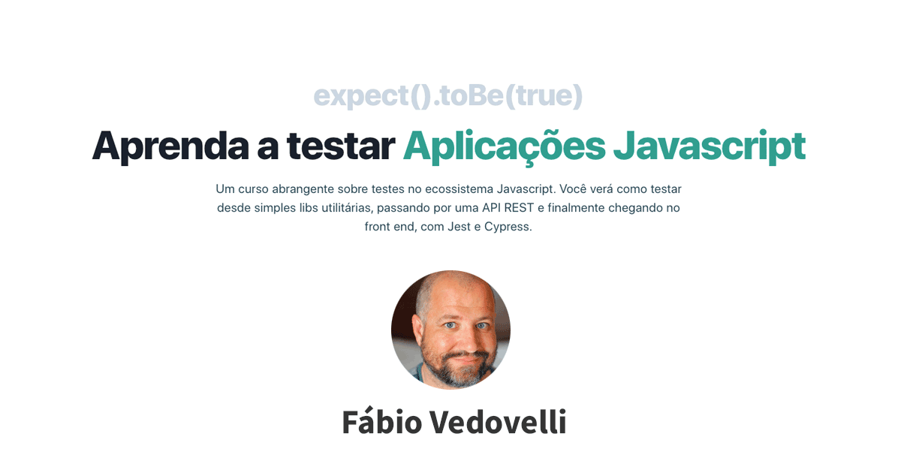

<div align="center" id="top"> 
  
</div>

<h1 align="center">Learn how to test Javscript applications - Module 3</h1>
<br>

## About

This project contains the initial files to use in Module 3 where is possible to learn how to test Javascript application development with React, Next and Tailwind.

## Technologies

The following tools were used in this project:

- [Node.js](https://nodejs.org/en/)
- [React](https://pt-br.reactjs.org/)
- [Next](https://nextjs.org/)
- [Tailwind](https://tailwindcss.com/)
- [Jest](https://jestjs.io/)
- [Testing Library](https://testing-library.com/)

## Requirements

Before starting, you need to have [Git](https://git-scm.com) and [Node](https://nodejs.org/en/) installed.

## :checkered_flag: Starting

```bash
# Clone this project
$ git clone https://github.com/{{YOUR_GITHUB_USERNAME}}/curso-javascript-testes-modulo-3

# Access
$ cd curso-javascript-testes-modulo-3

# Install dependencies
$ yarn

# Run the project
$ yarn start

# The server will initialize in the <http://localhost:3000>
```

<a href="#top">Back to top</a>
